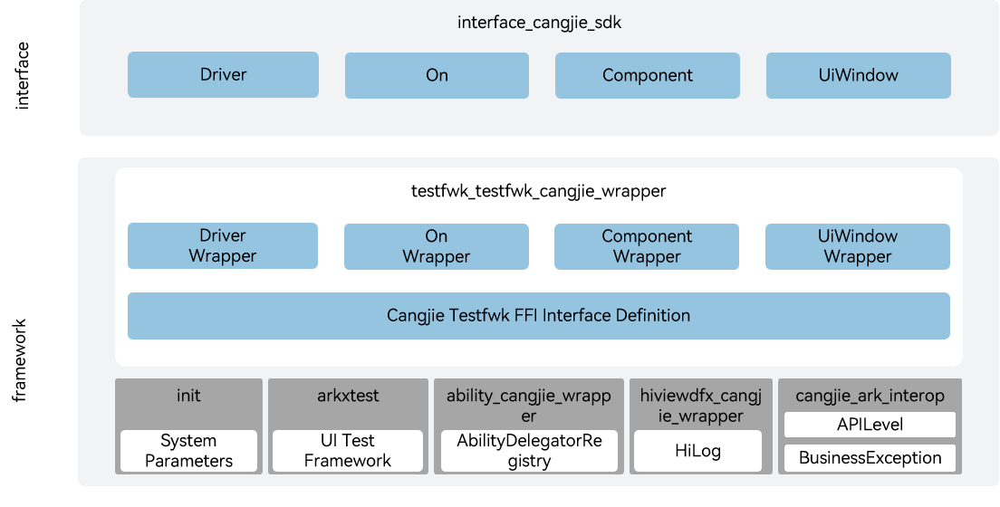

# testfwk_testfwk_cangjie_wrapper

## Introduction

The testfwk_testfwk_cangjie_wrapper is a Cangjie API encapsulated on OpenHarmony based on the capabilities of the arkXtest. arkXtest, the automated test framework of OpenHarmony, consists of the Cangjie unit test framework (CjUnit) and UI test framework (UiTest).The currently open arkXtest apis only support standard devices.

## System Architecture

**Figure 1** testfwk_cangjie_wrapper architecture



As shown in the architecture pictures, arkXtest provides UI test framework:

- Driver provides the UI test entry. It provides APIs for locating a component, checking whether a component exists, and injecting a key.
- On describes the attributes (such as text, ID, and type) of UI components, Driver locates the component based on the attributes described by On.
- Component provides the UI component object, which provides APIs for obtaining component attributes, clicking a component, and scrolling to search for a component.
- UiWindow provides the window object, which provides APIs for obtaining window attributes, dragging a window, and adjusting the window size.
- Cangjie Testfwk FFI Interface Definition： Responsible for defining the C-interoperable Cangjie interface, which is used to realize Cangjie's testfwk capabilities.
- arkxtest：Responsible for providing the basic ui test fuctions, and encapsulating the C interface for interoperation with Cangjie.

## Directory Structure

```
test/testfwk/testfwk_cangjie_wrapper
├── figures         # architecture pictures
├── kit             # Cangjie arkXtest kit code
│   └── TestKit     # Cangjie arkXtest code
└── ohos
    └── ui_test
```

## Usage

The following features are provided:

- Writing test cases, assert, executing unit test cases, and generating test reports.
- Locating and operating UI components.

Compare to the ArkTs, the following features are not provided:

- Mock Capability.

For relevant API of UiTest, please refer to [ohos.ui_test (UI Testing)](https://gitcode.com/openharmony-sig/arkcompiler_cangjie_ark_interop/blob/master/doc/API_Reference/source_en/apis/TestKit/cj-apis-ui_test.md); for relevant guidelines, please refer to Automated Test Framework Usage Guide.

## Code Contribution

Developers are welcome to contribute code, documentation, etc. For specific contribution processes and methods, please refer to [Code Contribution](https://gitcode.com/openharmony/docs/blob/master/en/contribute/code-contribution.md).

## Repositories Involved

[arkXtest](https://gitee.com/openharmony/testfwk_arkxtest/blob/master/README_en.md)

[ability_ability_cangjie_wrapper](https://gitcode.com/openharmony-sig/ability_ability_cangjie_wrapper)

[arkui_arkui_cangjie_wrapper](https://gitcode.com/openharmony-sig/arkui_arkui_cangjie_wrapper)

[arkcompiler_cangjie_ark_interop](https://gitcode.com/openharmony-sig/arkcompiler_cangjie_ark_interop)

[bundlemanager_bundlemanager_cangjie_wrapper](https://gitcode.com/openharmony-sig/bundlemanager_bundlemanager_cangjie_wrapper)

[hiviewdfx_hiviewdfx_cangjie_wrapper](https://gitcode.com/openharmony-sig/hiviewdfx_hiviewdfx_cangjie_wrapper)

[init](https://gitee.com/openharmony/startup_init)
