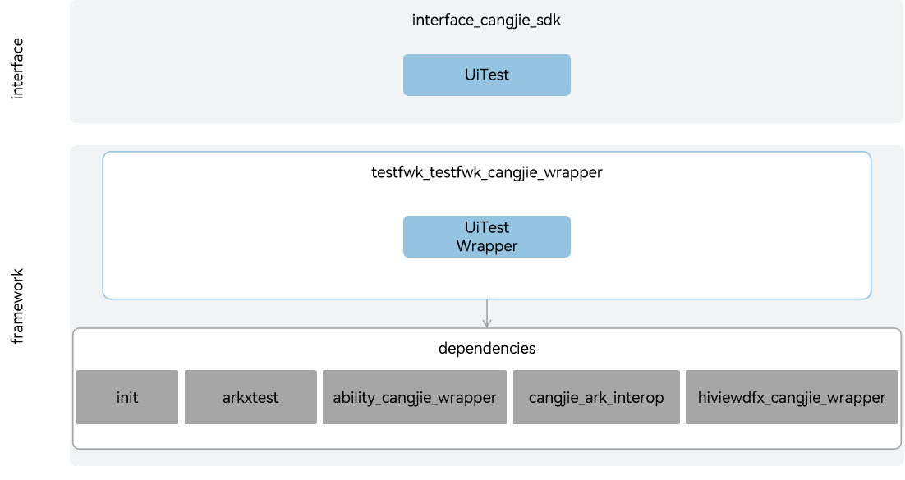

# testfwk_testfwk_cangjie_wrapper

## Introduction

The testfwk_testfwk_cangjie_wrapper is a Cangjie API encapsulated on OpenHarmony based on the capabilities of the test subsystem. The test subsystem provides developers with a set of automated testing frameworks. The Cangjie test framework API consists of a unit test framework and a UI test framework. The currently open Cangjie test framework API only supports standard devices.

## System Architecture

**Figure 1** testfwk_cangjie_wrapper architecture



As shown in the architecture diagram, the Cangjie test framework API provides UI test framework functions:

- Driver: The entry point for UI testing, providing capabilities to find components, check component existence, and inject keys.
- On: Used to describe target component characteristics (text, ID, type, etc.), and Driver finds components based on the component characteristics described by On.
- Component: The component object returned by Driver search, providing touch and inspection capabilities such as querying component attributes and scrolling search.
- UiWindow: The window object returned by Driver search, providing capabilities to obtain window attributes and operate windows.
- Cangjie Testfwk FFI Interface Definition: Responsible for defining C interoperation Cangjie interfaces, used to implement Cangjie test framework capabilities.
- arkxtest: Responsible for providing UI test basic capabilities, encapsulating C interfaces for interoperation with Cangjie.
- init: Provides system parameter query capabilities, used to determine whether the current environment supports testing.
- ability: Provides automated test framework management capabilities, used to monitor the lifecycle status changes of specified Ability and obtain test parameters.
- hiviewdfx: Provides a logging system, enabling applications/services to output log content according to specified levels, identifiers, and format strings.
- ark_interop: Provides APILevel and BusinessException.

## Directory Structure

```
test/testfwk/testfwk_cangjie_wrapper
├── figures         # architecture pictures
├── kit             # Cangjie test framework kit code
│   └── TestKit     # Test framework kit module
└── ohos            # Cangjie test framework interface implementation
│   └── ui_test     # UI test framework implementation
└── test            # Cangjie test framework test cases
```

## Usage

The Cangjie test framework API currently provides the following functions:

- Capabilities for writing test cases, assertions, executing test cases, and generating test reports.
- Capabilities for locating and operating UI components.

Compared to ArkTs, there are the following differences:

- The unit test framework is implemented based on the unit test library std.unittest that comes with Cangjie.

For UI test related APIs, please refer to [ohos.ui_test (UI Testing)](https://gitcode.com/openharmony-sig/arkcompiler_cangjie_ark_interop/blob/master/doc/API_Reference/source_en/apis/TestKit/cj-apis-ui_test.md). For related guidelines, please refer to [Automated Test Framework Usage Guide](https://gitcode.com/openharmony-sig/arkcompiler_cangjie_ark_interop/blob/master/doc/Dev_Guide/source_en/application-test/cj-arkxtest-guidelines.md).

## Code Contribution

Developers are welcome to contribute code, documentation, etc. For specific contribution processes and methods, please refer to [Code Contribution](https://gitcode.com/openharmony/docs/blob/master/en/contribute/code-contribution.md).

## Repositories Involved

[ability_ability_cangjie_wrapper](https://gitcode.com/openharmony-sig/ability_ability_cangjie_wrapper)
[arkcompiler_cangjie_ark_interop](https://gitcode.com/openharmony-sig/arkcompiler_cangjie_ark_interop)
[hiviewdfx_hiviewdfx_cangjie_wrapper](https://gitcode.com/openharmony-sig/hiviewdfx_hiviewdfx_cangjie_wrapper)
[startup_init](https://gitcode.com/openharmony/startup_init)
[testfwk_arkxtest](https://gitcode.com/openharmony/testfwk_arkxtest)