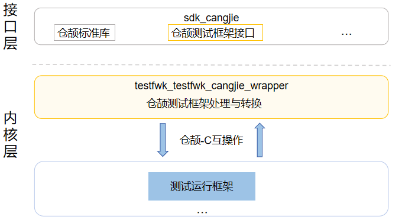

# 测试框架仓颉接口

## 简介

 测试框架仓颉接口是在 OpenHarmony 上基于测试子系统能力之上封装的仓颉API。而测试子系统是OpenHarmony为开发者提供了一套全面的自测试框架，开发者可根据测试需求开发相关测试用例，开发阶段提前发现缺陷，大幅提高代码质量。

## 目录

```
test/testfwk/testfwk_cangjie_wrapper
├── ohos             # 仓颉自动化测试框架接口实现
├── kit              # 仓颉kit化代码
```

## 系统架构

**图 1**  测试框架仓颉架构图



## 单元测试框架功能特性

| No.  | 特性     | 功能说明                                               |
| ---- | -------- |----------------------------------------------------|
| 1    | 基础流程 | 支持编写及异步执行基础用例。                                     |
| 2    | 断言库   | 判断用例实际结果值与预期值是否相符。                                 |
| 3    | Mock能力 | 支持函数级mock能力，对定义的函数进行mock后修改函数的行为，使其返回指定的值或者执行某种动作。 |
| 4    | 数据驱动 | 提供数据驱动能力，支持复用同一个测试脚本，使用不同输入数据驱动执行。                 |
| 5    | 专项能力 | 支持测试套与用例筛选、随机执行、压力测试、超时设置、遇错即停模式，跳过，支持测试套嵌套等。      |

## 相关仓

[自动化测试框架](https://gitee.com/openharmony/testfwk_arkxtest/blob/master/README_zh.md)
