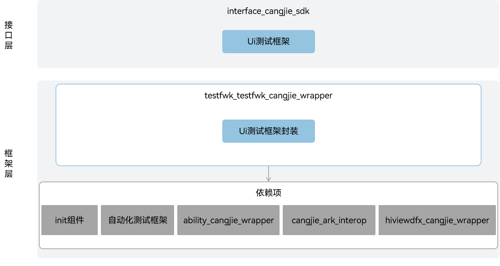

# 测试框架仓颉封装

## 简介

测试框架仓颉封装是在OpenHarmony上面向开发者使用仓颉语言进行应用开发时提供的一套UI测试框架。当前开放的测试框架仓颉封装仅支持standard设备。

## 系统架构

**图 1**  测试框架仓颉封装架构图



如架构图所示：

接口层：

- UI测试框架接口：面向开发者提供查找和操作界面控件的能力，支持用户开发基于界面操作的自动化测试脚本。
  - Driver: UI测试的入口，面向开发者提供检查控件存在性、查找控件，注入按键，单击坐标，滑动控件，手势操作，截图等接口能力。
  - On: 面向开发者提供了丰富的控件特征描述（文本、id、类型等）接口能力，用来匹配查找要操作或检视的目标控件。支持匹配单属性和匹配多属性组合以及支持相对定位控件。
  - Component: 表示UI界面上的一个控件对象，一般是通过Driver.findComponent(on: On)方法进行查找。控件对象面向开发者提供获取控件属性，单击控件，滑动查找，注入文本等接口能力。
  - UiWindow: 表示UI界面上的一个窗口对象，一般是通过Driver.findWindow(filter: WindowFilter)方法进行查找，其中WindowFilter可以设置待查找窗口的标题以及id等。窗口对象面向开发者提供获取窗口属性，进行窗口拖动、调整窗口大小等接口能力。

框架层：

- UI测试框架封装：基于底层自动化测试框架的UI测试基础能力实现UI测试框架封装，通过Driver类、On类、Component类以及UiWindow类提供一套完整的UI测试框架。

架构图中依赖部件引入说明：

- 自动化测试框架：UI测试框架封装的实现依赖自动化测试框架部件提供的UI测试基础能力。
- init组件: UI测试框架封装依赖init组件提供的系统参数查询能力，用于判断当前环境是否支持测试。
- ability_cangjie_wrapper：UI测试框架封装依赖ability_cangjie_wrapper提供的自动化测试框架管理能力，用于框架的初始化。
- hiviewdfx_cangjie_wrapper：UI测试框架封装依赖hiviewdfx_cangjie_wrapper提供的HiLog日志能力，用于在关键路径打印日志。
- cangjie_ark_interop：UI测试框架封装依赖cangjie_ark_interop提供的仓颉注解类定义和BusinessException异常类定义，用于对API进行标注，及在错误分支向用户抛出异常。

## 目录

```
test/testfwk/testfwk_cangjie_wrapper
├── figures         # 存放README架构图
├── kit             # 仓颉测试框架kit化代码
│   └── TestKit     # 测试框架kit模块
└── ohos            # 仓颉测试框架接口实现
│   └── ui_test     # UI测试框架实现
└── test            # 测试用例
    └── uitest  # UI测试框架测试用例
```

## 使用说明

当前测试框架仓颉封装提供了以下功能：

- UI测试框架。

UI测试相关的接口请参见[UI测试API文档](https://gitcode.com/openharmony-sig/arkcompiler_cangjie_ark_interop/blob/master/doc/API_Reference/source_zh_cn/apis/TestKit/cj-apis-ui_test.md)，相关开发指导请参见[自动化测试框架使用指南](https://gitcode.com/openharmony-sig/arkcompiler_cangjie_ark_interop/blob/master/doc/Dev_Guide/source_zh_cn/application-test/cj-arkxtest-guidelines.md)。

## 约束

与ArkTS提供的API能力相比，有以下差异：

- 暂不支持白盒性能测试框架。

## 参与贡献

欢迎广大开发者贡献代码、文档等，具体的贡献流程和方式请参见[参与贡献](https://gitcode.com/openharmony/docs/blob/master/zh-cn/contribute/%E5%8F%82%E4%B8%8E%E8%B4%A1%E7%8C%AE.md)。

## 相关仓

[ability_ability_cangjie_wrapper](https://gitcode.com/openharmony-sig/ability_ability_cangjie_wrapper)

[arkcompiler_cangjie_ark_interop](https://gitcode.com/openharmony-sig/arkcompiler_cangjie_ark_interop)

[hiviewdfx_hiviewdfx_cangjie_wrapper](https://gitcode.com/openharmony-sig/hiviewdfx_hiviewdfx_cangjie_wrapper)

[startup_init](https://gitcode.com/openharmony/startup_init)

[testfwk_arkxtest](https://gitcode.com/openharmony/testfwk_arkxtest)
